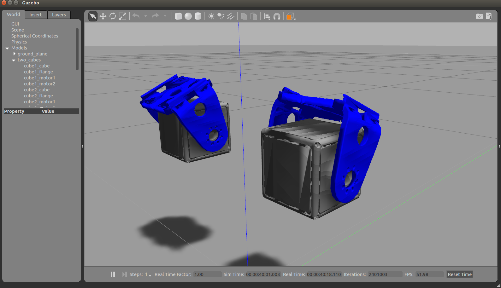

# qbmove_ros
Plugin for simulating variable stiffness actuators (VSA) like qbmove, 
easily embedding them in a robot in a Gazebo simulator and control them using ROS.

### Dependencies:
ROS

Gazebo

(Tested with ROS Kinetic and Gazebo7) 

### How to use:
Just add next code in your urdf 
(do not forget to remove your controller for the appropriate joint):
```
    <gazebo>
        <plugin name="qbmove_1" filename="libqbmove_plugin.so">
            <joint>your_joint</joint>
            <command_topic>/command_topic_name</command_topic>
            <pos_topic>/position_topic_name</pos_topic>
        </plugin>
    </gazebo>
```

### Example:
```
catkin build
roslaunch qbmove_example two_cubes.launch
```
And now you have ros topics and can control your VSA:
- /qbmove_1/command
- /qbmove_1/position
- /qbmove_2/command
- /qbmove_2/position




### Thanks
 [valeria-parnenzini](https://github.com/valeria-parnenzini) for the initial work on plugin:
 https://github.com/valeria-parnenzini/qbmove_plugin